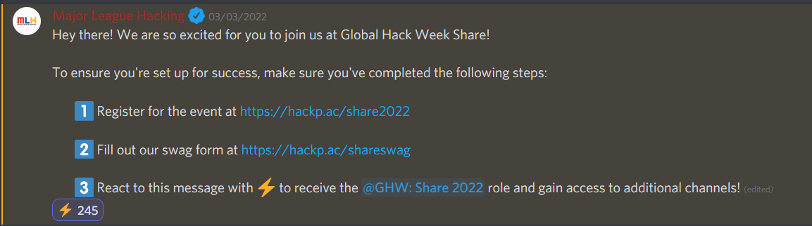

# Registration Process

### 1. Register for the week long event

Go to [https://organize.mlh.io/participants/events/7192-local-hack-day-share-2022](https://organize.mlh.io/participants/events/7192-local-hack-day-share-2022) and register for the event

.png>)&#x20;

### 2. Fill up the Swag Form 😋

* To win some goodies, you can fill out the form and enter your details: [https://hackp.ac/ShareSwag](https://hackp.ac/ShareSwag)
* Also fill out the address form, for the shipment [https://hackp.ac/address](https://hackp.ac/address)

### 3. Join the MLH Discord Chat

* Here is the invitation to the chat: [https://discord.com/invite/mlh](https://discord.com/invite/mlh)
* You'll also need to accept the rules on: [https://discord.mlh.io/](https://discord.mlh.io)
* Find the #join-ghw-share channel and react to the message

### 4. Join the EddieHub Guild.

* Go back to [https://discord.mlh.io/](https://discord.mlh.io) and select EddieHub as your guild
* Also join the EddieHub discord: [https://discord.com/invite/jZQs6Wu](https://discord.com/invite/jZQs6Wu)
* Now you get access to both #eddiehub (private guild chat) and the EddieHub discord chat.

